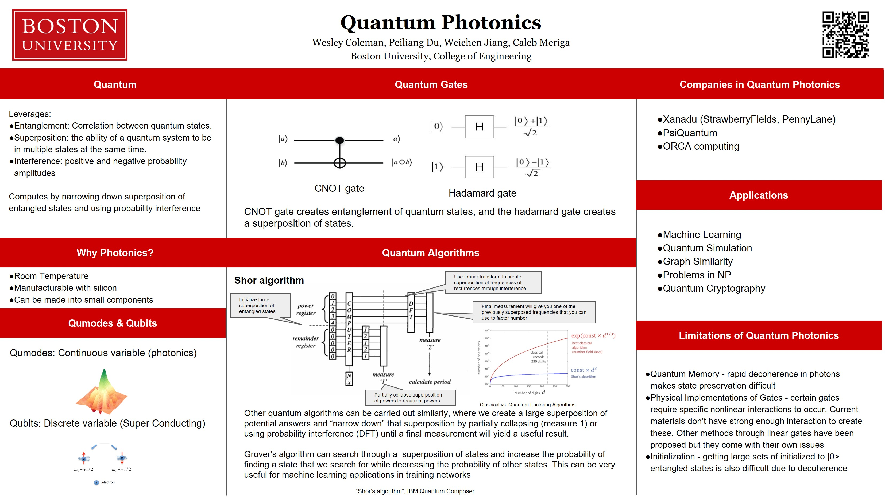
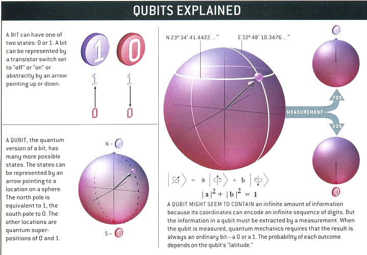
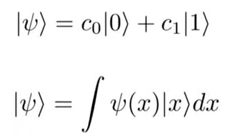

# Quantum Photonics 
## Wesley Coleman, Peiliang Du, Weichen Jiang, Caleb Meriga

Our group focus on researching the industry of quantum photonics. We explored the python quantum photonics simulator from Strawberry Fields Xanadu, 
learned quantum photonics concepts, and researched the algorithms in quantum photonics. 

# Poster

# Introduction
In the year 1961, Jack Kilby and Robert Noyce invented ‘Silicon chip’, an invention that changed the course of computers. Shrinking a room sized computer into a handheld device, from 5.3Hz clock (Z3 computer-1941)/2.25MHz clock (UNIVAC I -1951) to 8722.78MHz clock (AMD FX-8370) this rapid advancement in technology is due to silicon chip technology. In 1965, Gordon Moore made a statement, he stated that “the number of transistors on a chip doubles every 24 months”[1].This statement was held true. But from the past few years, the number of transistors on a chip reached saturation due to technological limitation to fabricate transistors under 3nm. Even if we find a way around it in near future, there is always the problem of quantum tunneling of electrons. Because of this, controlling and maintain the state of the transistors under 3nm is something which won’t be achieved in the near future as well. Let us consider someone will come up with a way to solve this. Then The Switching speed of the transistor will say Hi!. The only reason we scale down the transistors is to achieve low power consumption, high speed and to improve efficiency. But there is a limit to how many times you can switch between the states of the transistor. “Now a days, it’s a feat for most elite of silicon to  even maintaining 5GHz for more than a few seconds. Even if we manage the switching speed the prime thing that will get effected is efficiency. For instance a 10 core CPU (i9) uses 100W @4.4GHz and it will easily reach 300W @5.4GHz i.e. the inefficiency is tripled to get 20% increase in performance”[2].

Photonic Chip can overcome the limitations of Integrated circuits. An integrated circuit (IC) consists of electric components such as resistors, capacitors, inductors and transistors. Similarly in Photonic Chip the optical components are made up of waveguides(similar to resistors and wires),Lasers(similar to transistors),phase shifters and polarizers. In IC’s electric flux flows through the circuit and similarly photos are the carriers in Photonic Chip.

Quantum is something which is at the end of the spectrum of downscaling FET's.A qbit can be represented by the spin of an elctron or by  the polarization of a single photon in which the two states can be taken to be the vertical polarization and the horizontal polarization.In a classical system, a bit would have to be in one state or the other. However, quantum mechanics allows the qubit to be in a coherent superposition of both states simultaneously, a property that is fundamental to quantum mechanics and quantum computing.Quantum photonics uses the  photon as qbit.

#### Why Photonic's?
To carry out quantum computation there are many technologies such as 
* SuperConducting Qbits
* Trapped Ions
* Silicon quantum dots
* Topological qbits
* Diamond vacancies

##### The main advantage's of using Photon as a qbit is 
* Can use room temperature hardware and it isn't complex as other qbits.
* Can be fabricated by aldredy existing silicon foundaries like samsung,Intel.

# Qbits Vs Qmodes !
Continuous variables just so you understand  the term,you can probably guess from the name "continuous variables" we're working with a continuous spectrum of real numbers so when you measure a qubit you break the superposition you measure either a 0 or 1 in this system(qunatum photonics)  you measure our Q modes.when you measure qbits you get  the result as a continuous number (3.67498547568345..............) to that effect you can sort of think of it as analogous to analog computing compared to digital computing. lights can be represented by electromagnetic wave so this is how we encode the continues degrees of freedom for instance the electromagnetic amplitude in different vectors etc. so this character is what allows us to physically carry the continuous variable information yeah so this is  sort of like a spectrum.Below at the top you have the qubit model where you just have two distinct States and you can almost think of this as starting to increase the number of states are allowed in your quantum system.[3]

   

# References
1. Gustafson, John L. "Moore's Law." (2011): 1177-1184.
2. Brett Bergan, Will CPU chips ever get to a base clock of 7 or 8 GHz, https://www.quora.com/Will-CPU-chips-ever-get-to-a-base-clock-of-7-or-8-GHz.
3. Strawberry Fields - software for photonic quantum computing,https://youtu.be/B2n0TxRDWPs
4. “Shor’s algorithm”, IBM Quantum Composer, https://quantum-computing.ibm.com/composer/docs/iqx/guide/shors-algorithm
5. 
6. "Quantum Photonics", Strawberry Fields by Xanadu, https://strawberryfields.ai/photonics/
7. Nathan Killoran, Josh Izaac, Nicolás Quesada, Ville Bergholm, Matthew Amy, and Christian Weedbrook. "Strawberry Fields: A Software Platform for Photonic Quantum Computing", Quantum, 3, 129 (2019).
8. Thomas R. Bromley, Juan Miguel Arrazola, Soran Jahangiri, Josh Izaac, Nicolás Quesada, Alain Delgado Gran, Maria Schuld, Jeremy Swinarton, Zeid Zabaneh, and Nathan Killoran. "Applications of Near-Term Photonic Quantum Computers: Software and Algorithms", Quantum Sci. Technol. 5 034010 (2020).
